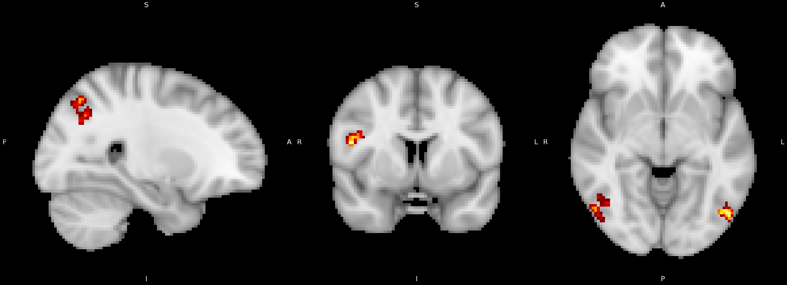

# Analysis Levels in Neuroimaging Studies

## PREPROCESSING

### A. Brain Extraction

Brain extraction (skull stripping) is a fundamental preprocessing step in neuroimaging that removes non-brain tissues from MRI images. This process is crucial for improving subsequent analyses by focusing computational resources on relevant brain tissue and eliminating potential artifacts from skull, scalp, and other non-brain structures.

#### 1) Threshold Parameter Optimization

The efficacy of brain extraction algorithms significantly depends on appropriate threshold parameter selection. The fractional intensity threshold controls the aggressiveness of tissue removal, presenting a critical trade-off between complete skull removal and brain tissue preservation.

**Brain Extraction Results Across Subjects:**

<table style="border-collapse: collapse; border: 2px solid white;">
  <tr style="border: 1px solid white;">
    <td style="border: 1px solid white; padding: 10px; text-align: center;"><strong>Sub-03</strong></td>
    <td style="border: 1px solid white; padding: 10px; text-align: center;"><strong>Sub-04</strong></td>
    <td style="border: 1px solid white; padding: 10px; text-align: center;"><strong>Sub-05</strong></td>
    <td style="border: 1px solid white; padding: 10px; text-align: center;"><strong>Sub-06</strong></td>
  </tr>
  <tr style="border: 1px solid white;">
    <td style="border: 1px solid white; padding: 5px;"></td>
    <td style="border: 1px solid white; padding: 5px;"></td>
    <td style="border: 1px solid white; padding: 5px;"></td>
    <td style="border: 1px solid white; padding: 5px;"></td>
  </tr>
  <tr style="border: 1px solid white;">
    <td style="border: 1px solid white; padding: 10px; text-align: center;"><strong>Sub-07</strong></td>
    <td style="border: 1px solid white; padding: 10px; text-align: center;"><strong>Sub-08</strong></td>
    <td style="border: 1px solid white; padding: 10px; text-align: center;"><strong>Sub-09</strong></td>
    <td style="border: 1px solid white; padding: 10px; text-align: center;"><strong>Sub-10</strong></td>
  </tr>
  <tr style="border: 1px solid white;">
    <td style="border: 1px solid white; padding: 5px;"></td>
    <td style="border: 1px solid white; padding: 5px;"></td>
    <td style="border: 1px solid white; padding: 5px;"></td>
    <td style="border: 1px solid white; padding: 5px;"></td>
  </tr>
</table>

#### 2) Multi-Subject Analysis Findings

Extensive testing across subjects revealed two important observations:

- **Displacement Variations**: Despite standardized protocols, slight positional differences emerge between subjects due to head positioning variations during acquisition
- **Contrast Differences**: Individual tissue properties and scanner calibration variations affect image contrast, requiring subject-specific parameter adjustment

These findings emphasize the importance of visual quality control and parameter optimization in neuroimaging preprocessing workflows.

### B. Motion Correction Analysis

Head motion during fMRI acquisition introduces significant artifacts that can compromise statistical analyses. Systematic motion parameter assessment ensures data quality and informs subsequent processing decisions.

#### 1) Motion Parameter Thresholds

Quality control assessment follows established criteria:
- **Relative displacement**: < 0.5 voxels (frame-to-frame movement)
- **Absolute displacement**: < 1.0 voxel (total displacement from reference)

#### 2) Motion Assessment Results

**Subject sub-08 Motion Parameters:**

<table style="border-collapse: collapse; border: 2px solid white;">
  <tr style="border: 1px solid white;">
    <td style="border: 1px solid white; padding: 10px; text-align: center;"><strong>Run 1</strong></td>
    <td style="border: 1px solid white; padding: 10px; text-align: center;"><strong>Run 2</strong></td>
  </tr>
  <tr style="border: 1px solid white;">
    <td style="border: 1px solid white; padding: 5px;"></td>
    <td style="border: 1px solid white; padding: 5px;"></td>
  </tr>
</table>

**Subject sub-08 Motion Assessment:**
- **Run 1**: Both relative and absolute displacement remained below 0.3 voxels throughout acquisition, indicating excellent data quality
- **Run 2**: Occasional peaks between 0.2-0.3 voxels with slightly elevated absolute displacement, but within acceptable limits

This analysis demonstrates that standard motion correction procedures are sufficient for this dataset, eliminating the need for advanced motion correction techniques.

### C. Registration and Normalization

Accurate spatial alignment between functional and anatomical images is essential for precise localization of brain activity. The degrees of freedom (DOF) parameter critically influences registration accuracy.

#### 1) Registration Output Example

*Figure 9: Subject sub-02 preprocessing results using Boundary-Based Registration (BBR) showing precise alignment of functional data to anatomical reference.*

#### 2) Registration Method Comparison

**12DOF Registration (Full affine transformation):**
- Includes translation, rotation, scaling, and shearing
- Compensates for EPI distortion artifacts
- Superior alignment accuracy compared to 3DOF
- Higher computational cost but better results

**Boundary-Based Registration (BBR):**
- Utilizes intensity gradients at tissue boundaries for enhanced alignment
- Superior cortical boundary alignment compared to standard 12DOF
- Optimal for cortical analysis studies requiring precise anatomical localization
- Significantly longer processing time but maximum accuracy

#### 3) Method Selection Considerations

The choice between registration methods should be guided by analysis requirements:
- **For cortical studies**: BBR provides superior boundary alignment critical for precise localization
- **For subcortical analyses**: 12DOF offers sufficient accuracy with faster processing
- **For clinical studies**: BBR recommended for maximum accuracy in pathology detection

The superior performance of advanced registration methods can be attributed to their ability to account for geometric distortions common in functional MRI acquisitions, particularly those arising from EPI sequences.

### D. Timing File Preparation

Conversion from BIDS format to FSL-compatible timing files was performed using the `make_FSL_Timings.sh` script:

- **Input**: BIDS-format event files (`*_events.tsv`)
- **Output**: FSL timing format files for congruent and incongruent conditions
- **Processing**: Separate timing files generated for each run and condition per subject
## Second Level Analysis

*Figure 1: Two-model design for each group of 13 subjects using Fixed Effects inference, combining multiple runs as one long run.*

In some programs like AFNI, second level refers to group analysis, but as we use FSL it's more like averaging parameter estimates and contrast estimates from the 1st-level analyses at the subject level. I took a slightly different approach from documents like Andy's Brain Book at second level analysis. Due to problems with FSL tools, instead of doing all 26 subjects at once, I divided them into groups of 13 subjects each, which should not affect the results or the dependent results at third analysis because this is at the subject level anyway.

This is the two-model design of each 13 subjects, using Fixed Effects inference that does not give different weights for the subjects and combines multiple runs from the same subject as if they were one long run.

Output of this level will be separated into two directories: `2ndlevel_part1` (first 13 subjects) and `2ndlevel_part2` (second 13 subjects). Each directory contains these output files:

- **Z-statistic maps** (`zstat*.nii.gz`): Voxel-wise statistical maps showing group-level significance for each contrast
- **Cope maps** (`cope*.nii.gz`): Effect size maps for each contrast
- **Variance maps** (`varcope*.nii.gz`): Variance of the contrast estimates
- **T-statistic maps** (`tstat*.nii.gz`): T-statistics for the group-level effects
- **Thresholded maps** (`thresh_zstat*.nii.gz`): Z-stat maps thresholded for significance
- **Cluster results** (`cluster_zstat*.txt`): Cluster-based inference results
- **Mean and mask files** (`mean_func.nii.gz`, `mask.nii.gz`): Reference images and analysis mask

## Third Level Analysis

*Figure 2: Overlay of the zstat.nii.gz image on the MNI152_brain.nii.gz image showing the average significance of the third-level contrast.*

Third level analysis is group-level analysis using inference methods like FLAME1, which works on all subject levels without assigning weights according to contrast or other parameters. It works on the output files from the previous analysis level (`cope3.feat/stats`) from each directory. I used the default values for post-stat inputs like threshold method (cluster-based), Z threshold "3.1", and cluster P threshold "0.05".

Output of this level is mostly the same as second level, but each file image represents the averaging of all subjects. Here we can overlay the `zstat.nii.gz` image on the `MNI152_brain.nii.gz` image to show the average significance of the third-level contrast. The red and yellow regions indicate statistically significant activations for the contrast represented. Red likely denotes higher z-values or more significant clusters, while yellow indicates slightly lower but still significant values.

According to our flanker task dataset, I can discuss the results from this level as:

- **Sagittal view**: Shows activation in the left prefrontal cortex (superior frontal gyrus), possibly linked to cognitive control or attention
- **Coronal view**: Highlights a midline region, potentially the anterior cingulate cortex, involved in conflict monitoring
- **Axial view**: Shows bilateral activations, possibly in the parietal lobes or insula, associated with attention and response inhibition

## ROI Analysis

*Figure 3: MNI152 T1 2mm template with the thresholded zstats for cope 1 (red/yellow), cope 2 (blue), and cope 3 (green).*

This image shows the MNI152 T1 2mm template with the thresholded zstats for cope 1 (red/yellow), cope 2 (blue), and cope 3 (green). After applying third level analysis and generating the average cope3 for all .feat files from second level data analysis (repeating this stage for cope1 and cope2), we can use them to identify the maximum cluster location at each thresholded zstat file. In this experiment, four clusters were obtained from each thresholded zstat file using the FSL cluster browser, which were then used to generate spherical masks.

The process involves the following steps:

1. **Third-level Analysis**: Apply third-level analysis to generate the average cope3 for all .feat files from the second-level data analysis, and repeat for cope1 and cope2

2. **Cluster Identification**: Use the thresholded zstat files to identify the maximum cluster locations, obtaining 4 clusters per file using the cluster browser

3. **Mask Generation**: Generate spherical masks for each cluster using the `generate_roi_masks.sh` script with 5mm radius spheres centered on peak coordinates

4. **Data Extraction**: Extract data from anatomical masks using the `fslmeants` command with each mask and its corresponding `copeX.nii.gz` file, storing results in text files using the `extract_data_from_masks.sh` script

5. **Statistical Analysis**: Use the Python script `t_test.py` to loop through the files, apply one-sample t-tests against zero, calculate t-statistics and p-values, and store the results in a `results.txt` file

The detailed implementation of these scripts and the specific commands used in each step are documented in the code repository, providing a comprehensive ROI-based analysis approach that complements the whole-brain third-level analysis.