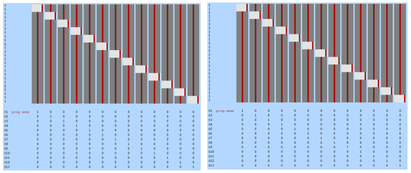

# Analysis Levels in Neuroimaging Studies

## Preprocessing

### Brain Extraction
Automated skull stripping was performed for all 26 subjects using FSL's BET2 tool. The pipeline implemented threshold optimization to ensure optimal skull stripping across all subjects:

- **Threshold Testing**: Systematic testing of fractional intensity thresholds from 0.1 to 0.9
- **Optimal Threshold**: 0.3 was selected based on visual inspection and quality metrics
- **Batch Processing**: Automated processing with comprehensive error handling and quality control
- **Output**: Skull-stripped T1-weighted images for all subjects

### Timing File Preparation
Conversion from BIDS format to FSL-compatible timing files was performed using the `make_FSL_Timings.sh` script:

- **Input**: BIDS-format event files (`*_events.tsv`)
- **Output**: FSL timing format files for congruent and incongruent conditions
- **Processing**: Separate timing files generated for each run and condition per subject

## Second Level Analysis

*Figure 1: Two-model design for each group of 13 subjects using Fixed Effects inference, combining multiple runs as one long run.*

In some programs like AFNI, second level refers to group analysis, but as we use FSL it's more like averaging parameter estimates and contrast estimates from the 1st-level analyses at the subject level. I took a slightly different approach from documents like Andy's Brain Book at second level analysis. Due to problems with FSL tools, instead of doing all 26 subjects at once, I divided them into groups of 13 subjects each, which should not affect the results or the dependent results at third analysis because this is at the subject level anyway.

This is the two-model design of each 13 subjects, using Fixed Effects inference that does not give different weights for the subjects and combines multiple runs from the same subject as if they were one long run.

Output of this level will be separated into two directories: `2ndlevel_part1` (first 13 subjects) and `2ndlevel_part2` (second 13 subjects). Each directory contains these output files:

- **Z-statistic maps** (`zstat*.nii.gz`): Voxel-wise statistical maps showing group-level significance for each contrast
- **Cope maps** (`cope*.nii.gz`): Effect size maps for each contrast
- **Variance maps** (`varcope*.nii.gz`): Variance of the contrast estimates
- **T-statistic maps** (`tstat*.nii.gz`): T-statistics for the group-level effects
- **Thresholded maps** (`thresh_zstat*.nii.gz`): Z-stat maps thresholded for significance
- **Cluster results** (`cluster_zstat*.txt`): Cluster-based inference results
- **Mean and mask files** (`mean_func.nii.gz`, `mask.nii.gz`): Reference images and analysis mask

## Third Level Analysis

*Figure 2: Overlay of the zstat.nii.gz image on the MNI152_brain.nii.gz image showing the average significance of the third-level contrast.*

Third level analysis is group-level analysis using inference methods like FLAME1, which works on all subject levels without assigning weights according to contrast or other parameters. It works on the output files from the previous analysis level (`cope3.feat/stats`) from each directory. I used the default values for post-stat inputs like threshold method (cluster-based), Z threshold "3.1", and cluster P threshold "0.05".

Output of this level is mostly the same as second level, but each file image represents the averaging of all subjects. Here we can overlay the `zstat.nii.gz` image on the `MNI152_brain.nii.gz` image to show the average significance of the third-level contrast. The red and yellow regions indicate statistically significant activations for the contrast represented. Red likely denotes higher z-values or more significant clusters, while yellow indicates slightly lower but still significant values.

According to our flanker task dataset, I can discuss the results from this level as:

- **Sagittal view**: Shows activation in the left prefrontal cortex (superior frontal gyrus), possibly linked to cognitive control or attention
- **Coronal view**: Highlights a midline region, potentially the anterior cingulate cortex, involved in conflict monitoring
- **Axial view**: Shows bilateral activations, possibly in the parietal lobes or insula, associated with attention and response inhibition

## ROI Analysis

*Figure 3: MNI152 T1 2mm template with the thresholded zstats for cope 1 (red/yellow), cope 2 (blue), and cope 3 (green).*

This image shows the MNI152 T1 2mm template with the thresholded zstats for cope 1 (red/yellow), cope 2 (blue), and cope 3 (green). After applying third level analysis and generating the average cope3 for all .feat files from second level data analysis (repeating this stage for cope1 and cope2), we can use them to identify the maximum cluster location at each thresholded zstat file. In this experiment, four clusters were obtained from each thresholded zstat file using the FSL cluster browser, which were then used to generate spherical masks.

The process involves the following steps:

1. **Third-level Analysis**: Apply third-level analysis to generate the average cope3 for all .feat files from the second-level data analysis, and repeat for cope1 and cope2

2. **Cluster Identification**: Use the thresholded zstat files to identify the maximum cluster locations, obtaining 4 clusters per file using the cluster browser

3. **Mask Generation**: Generate spherical masks for each cluster using the `generate_roi_masks.sh` script with 5mm radius spheres centered on peak coordinates

4. **Data Extraction**: Extract data from anatomical masks using the `fslmeants` command with each mask and its corresponding `copeX.nii.gz` file, storing results in text files using the `extract_data_from_masks.sh` script

5. **Statistical Analysis**: Use the Python script `t_test.py` to loop through the files, apply one-sample t-tests against zero, calculate t-statistics and p-values, and store the results in a `results.txt` file

The detailed implementation of these scripts and the specific commands used in each step are documented in the code repository, providing a comprehensive ROI-based analysis approach that complements the whole-brain third-level analysis.